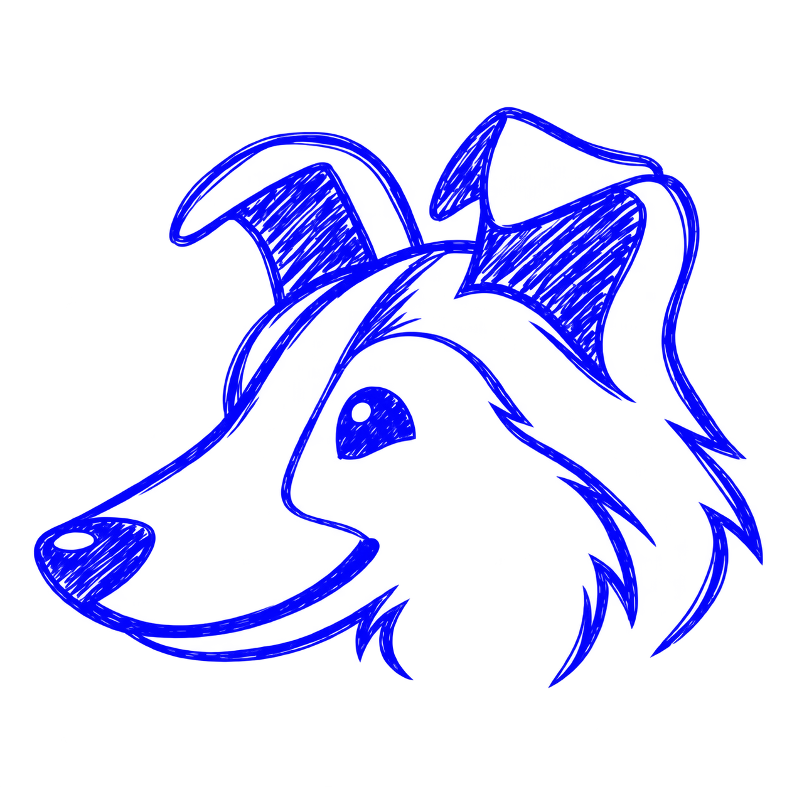
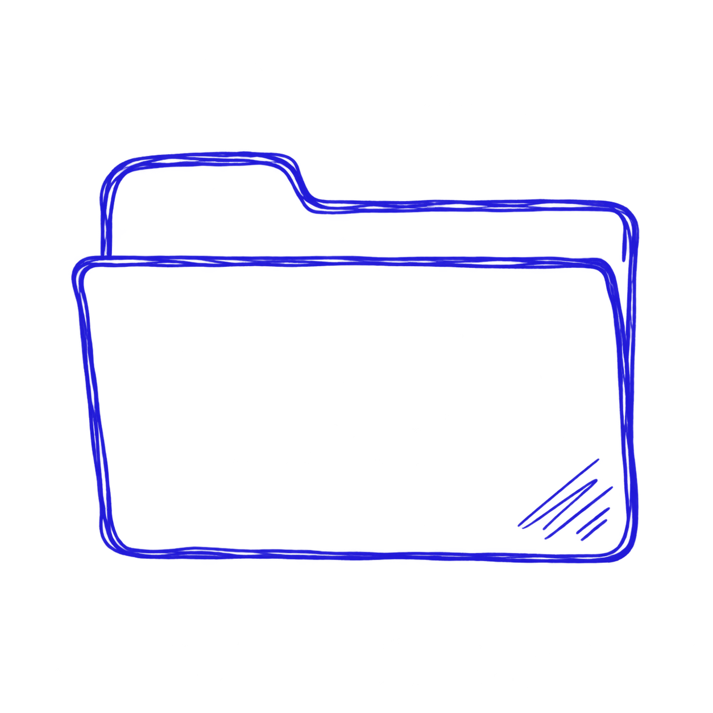

# Pen logo assets

Two blue pen-style logos with transparent backgrounds. These are AI-generated
PNG images, not procedural Drawably components: they do not re-sketch, animate,
or respond to the library's colour options.

## Sheltie head

Left-facing Sheltie head with tipped ears and a smiling muzzle.



[Download the Sheltie head](./sheltie-head-pen.png)

## Folder

A folder with a raised tab and a scribbled corner accent.



[Download the folder](./folder-pen.png)

## Use in an application

Copy the desired PNG to your application's public assets directory and render
it as a standard image. For example, after copying to `public/images/`:

```html


```

Use `alt=""` when an image is decorative or accompanies an equivalent text
label. The blue strokes are best viewed against a light background. The
transparent regions can show the application's background through the artwork.

These assets are stored in the fork and are not included in the npm package.
